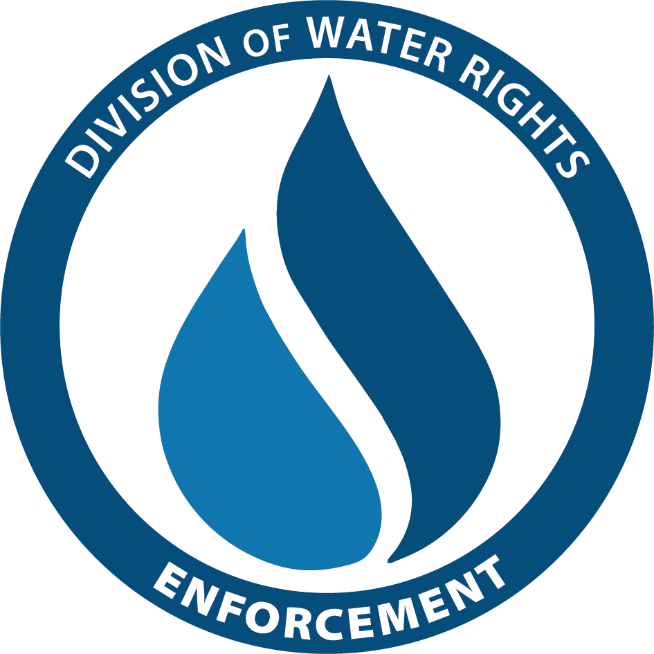

# Scott-River Flow Monitoring Dashboard
### Division of Water Rights – Enforcement

.center[

]

---

## Project Purpose

- Provide real-time visibility into Scott and Shasta River streamflow conditions.
- Compare recorded flows to regulatory minimum instream flow (MIF) thresholds.
- Help identify potential curtailment violations by visualizing Points of Diversion (PODs).

---

## Data Sources

- **CDEC** – California Data Exchange Center for hourly flow data.
- **AWS S3** – Storage of preprocessed POD and water right datasets.
- **Shapefiles** – For watershed boundaries and stream networks.

---

## Key Features

- Live gauges for **SFJ** and **SRY** with MIF thresholds.
- Interactive map showing:
  - POD curtailment status
  - Clickable CDEC station links
  - Watershed and stream overlays
- Mobile and desktop optimized

---

## Technologies Used

- **R / Shiny / Leaflet** for interactive web dashboard
- **flexdashboard** for gauge rendering
- **quarto / revealjs** for this presentation
- **aws.s3**, **sf**, **cder**, **DT**, **purrr**

---

## Access the Dashboard

.center[

]

<https://cawaterdatadive.shinyapps.io/scott-shasta-flow-dashboard/>
